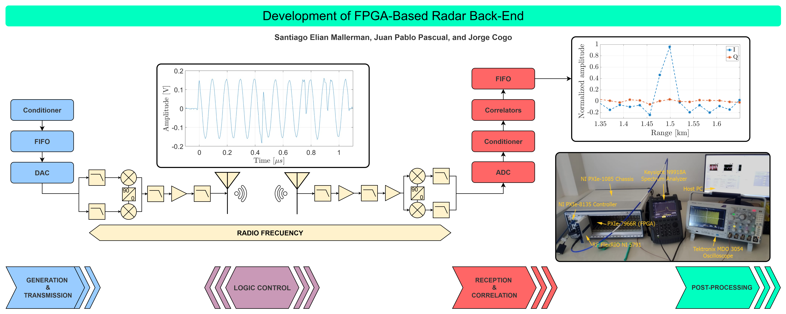

# Development of FPGA-Based Radar Back-End


This repository contains the LabVIEW FPGA implementation developed for the paper **"Development of FPGA-Based Radar Back-End"** published in IEEE Latin America Transactions.

---

## Table of contents

- [Abstract](#abstract)
- [Paper citation](#paper-citation)
- [Repository layout](#repository-layout)
- [Requirements](#requirements)
  - [Hardware](#hardware)
  - [Software](#software)
- [Installation / Setup](#installation--setup)
- [How to run](#how-to-run)
- [Files produced (outputs)](#files-produced-outputs)
- [FPGA build & deployment notes](#fpga-build--deployment-notes)
- [Known limitations & troubleshooting](#known-limitations--troubleshooting)
- [How to cite / license](#how-to-cite--license)
- [Contact](#contact)

---

## Abstract

This work presents the development of the digital back-end of a pulsed radar based on Field Programmable Gate
Array (FPGA) technology. The development includes the stages dedicated to the generation of diverse baseband signals, including square pulses, chirps, and Barker codes, and the processing of the received signal through a series of correlators with adaptable sampling rates for pulse compression and oversampling scenarios.

The system is physically implemented taking advantage of the facilities offered by a FlexRIO® development platform, as well as the associated development environment. The system parameters, like pulse duration, guard interval, and pulse repetition period, as well as parameters specific to each modulation scheme, are widely adjustable to meet user requirements such as maximum range, Doppler resolution and sensitivity.

The stages of signal generation are verified digitally through experimental tests using RF measurement equipment, demonstrating a high consistency between them and what is theoretically predicted. The correlation stage is validated using a synthetic target generated by a digital delay and including a noisy channel, showing a strong correlation between the obtained output and the theoretical expectation. These results constitute an important advance in the development of a low-power, reconfigurable monostatic pulsed radar platform that will serve as a versatile testbed for algorithmic experimentation.



## Paper citation


> Mallerman, S. E., Pascual, J. P., and  Cogo, J., "Development of FPGA-Based Radar Back-End," *IEEE Latin America Transactions*, Year. DOI: `xxx`


## Repository layout

The project hierarchy and folders description is as follows

```
radar.lvproj
├─ Project Documentation/
├─ Support Files/
│  ├─ Device Configuration/
│  ├─ FPGA VIs/
│  ├─ RX Stream/
│  ├─ TX Stream/
│  └─ Utilities/
├─ RADAR (HOST).vi
├─ NI 5791 & 7966/
│  ├─ Board IO/
│  ├─ FIFOs/
│  ├─ IO Module Status/
│  ├─ PXI/
│  ├─ PXIe/
│  ├─ IO Module/
│  ├─ On Board clock/
│  ├─ IP Builder/
│  ├─ Dependencies/
│  ├─ Build Specifications/
│  └─ RADAR (FPGA).vi
├─ Dependencies/
├─ Build Specifications/
```

> **Note:** folder and VI names reflect the LabVIEW project tree. Keep the hierarchy when you add or modify VIs so that the project compiles correctly.


## Requirements

### Hardware

1. NI PXIe-1085 chassis (PXI Express chassis)
2. FlexRIO NI 5791 (RF adapter module)
3. PXIe-7966R (FPGA module)
4. NI PXIe-8135 (controller)


### Software

1. **Windows 7 SP1** (host OS used during development)
2. **Xilinx ISE 14.7** (for synthesizing FPGA IP compatible with LabVIEW FPGA 2017)
3. **LabVIEW 2017 SP1** (development environment)
4. **LabVIEW Real-Time 2017**
5. **LabVIEW FPGA Module 2017**
6. **NI-RIO / FlexRIO drivers** (drivers for NI RIO, FlexRIO and PXIe devices compatible with the above LabVIEW and OS versions)

> Make sure all NI and Xilinx versions are compatible. Use the NI Compatibility Chart for your exact OS / driver combinations when preparing a new machine:  
> 🔗 [NI Driver and Development Software Compatibility Chart](https://www.ni.com/en/support/documentation/compatibility/23/ni-driver-and-development-software-compatibility-.html)

## Installation / Setup

1. Install Windows 7 SP1 and enable required OS updates.
2. Install Xilinx ISE 14.7 and add it to PATH if required by your FPGA toolchain.
3. Install LabVIEW 2017 SP1 and the Real-Time and FPGA modules (2017).
4. Install NI-RIO / FlexRIO drivers for your OS and LabVIEW version.
5. Connect the PXIe chassis, insert the PXIe-7966R and the FlexRIO NI 5791 adapter, and power up the system.
6. Open `radar.lvproj` in LabVIEW on the PXIe controller or development PC (depending on your workflow).


## How to run

1. Configure the RIO device. Ensure the correct target (PXIe-7966R) and RF adapter (NI 5791) are selected from the project panel.  
2. Open the LabVIEW project `radar.lvproj` and open the VI `Radar (Host).vi` (Host front panel).
3. Configure RF and clock parameters (sample rates, ADC/DAC settings, reference clock source) from the host front panel.  
4. Configure operational radar parameters: PRP, guard width, CPI, number of CPIs.  
5. Configure wave generation parameters: waveform type (square, chirp, Barker), pulse width (us), and bandwidth as needed.  
6. Configure correlator bank parameters with oversampling factor.  
7. Press **RUN** on the host VI. The host will:  
   - compile / program the FPGA bitfile if necessary (see FPGA build notes below),  
   - configure runtime parameters, and  
   - start data capture and file logging.

> The normal runtime flow is: `Radar (Host)` → configure device & parameters → start acquisition → host saves outputs to `project%/data/YYYY-MM-DD/`.


## Files produced (outputs)

When a run is executed the project automatically creates a `project%/data/YYYY-MM-DD/` folder and writes four files per run. File names and fields follow this convention:

1. **`settings_YYYY-MM-DD_HHMM.lvm`**
   - Contains the test parameters (human-readable LabVIEW Measurement file). Typical fields saved:
     - `p_type` (waveform type)
     - `oversampling_factor`
     - `prp_us` (Pulse Repetition Period in microseconds)
     - `pulseWidth_ns` (pulse width in nanoseconds)
     - `freqSamp` (sampling frequency used for final output in Hz)
     - `freqCarrier` (carrier frequency in Hz)
     - `reference_level_dBm` (reference level used)
     - `cpi` (coherent processing interval in number of pulses)
     - `nroCPIs` (number of CPIs)
     - `numRangeCell` (range cells samples per PRP)
     - `pulseRangeCell` (range cells samples per pulse)
     - `guard_us` (guard width in microseconds)

2. **`rxIQ__YYYY-MM-DD_HHMM_runid.lvm`**
   - Conditioned Rx IQ samples captured directly from the RF front-end at **130 MHz** sample rate (as delivered by the conditioning chain). `runid` is a sequential run number.

3. **`pulseIQ__YYYY-MM-DD_HHMM_runid.lvm`**
   - Conditioned Tx IQ samples (transmit waveform recorded / generated) at **130 MHz**.

4. **`dataIQ__YYYY-MM-DD_HHMM_runid.lvm`**
   - Cross-correlation output IQ samples (correlator bank output) sampled at `freqSamp` Hz (see `settings_*` for the exact `freqSamp`).

> All `.lvm` files are standard LabVIEW Measurement files (ASCII text with headers). Use LabVIEW or a simple parser (MATLAB/Python) to import them for post-processing.


## FPGA build & deployment notes

- The FPGA VIs and IP were developed targeting **LabVIEW FPGA 2017** and **Xilinx ISE 14.7** synthesis flow. Use Xilinx ISE 14.7 to satisfy the LabVIEW FPGA module toolchain requirements.  
- Under `NI 5791 & 7966/Build Specifications` you will find the build specifications and IP builder VIs used to generate and package custom IP.  
- If you modify FPGA top-level or IP, rebuild from the LabVIEW project:  
  1. Open the FPGA target VI (`RADAR (FPGA).vi`).  
  2. Run **Tools → Build → Build All** (or the build specification shown in project).  
  3. Once the bitfile is generated, deploy it to the device from the Host VI or using NI MAX for offline programming.


## Known limitations & troubleshooting

- Development and testing were performed on **Windows 7 SP1**. Different OS versions may require different driver versions.
- Xilinx ISE 14.7 is required by LabVIEW FPGA 2017—newer Xilinx toolchains (Vivado) are not compatible with these older LabVIEW versions.
- If device resources (FPGA logic utilization) are high, the build will fail — check the `FPGA VIs` and optimize or reduce correlator bank size or oversampling factor.
- If the host cannot see the RIO device, verify NI-RIO drivers and that the PXIe chassis is powered and visible in NI MAX.


## How to cite / License

If you use this code in academic work, please cite the paper as:

> Mallerman, S. E., Pascual, J. P., and  Cogo, J., "Development of FPGA-Based Radar Back-End," *IEEE Latin America Transactions*, Year. DOI: `xxx`


## Contact

For questions, bug reports or contributions please open an issue.

